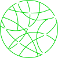
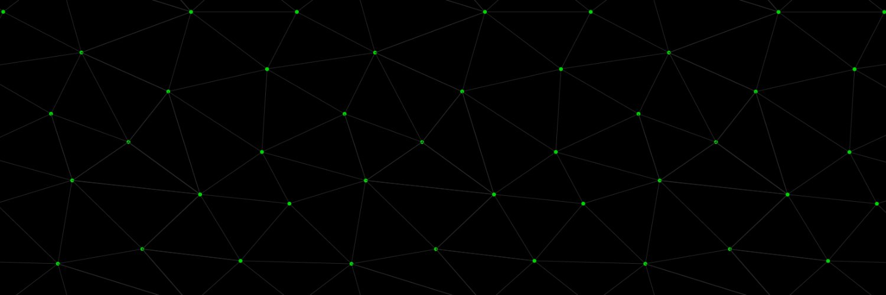

<a href="https://www.neopower.digital/" style="text-decoration:none; color:white">

neopower

</a>

# ink!athon dApp

This is a repository with a base implementation for Polkadot projects using [use-inkathon](https://github.com/scio-labs/use-inkathon) react library that can be used as a template for creating a new project.
