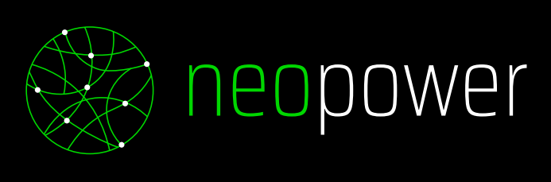

<p align="center">
   <a href="https://www.neopower.digital/">   
     
   </a>
</p>


# ink!athon dApp

This is a repository with a base implementation for Polkadot projects using [use-inkathon](https://github.com/scio-labs/use-inkathon) react library that can be used as a template for creating a new project. \
This project uses [MUI](https://mui.com/) component library.

# Table of contents

1. [Running the template](#running-the-template)
2. [Use-inkathon library](#use-inkathon-library)
   1. [Initial configuration](#initial-configuration)
   2. [Wallet connection](#wallet-connection)
      1. [Connecting wallet state](#connecting-wallet-state)
   3. [Switch chain](#switch-chain)
      1. [Switching chain state](#switching-chain-state)
      2. [Adding a Substrate Chain](#adding-a-substrate-chain)

# Running the template

```python
#In first place we have to install the required dependencies
yarn
#Now we can run develompent server
yarn dev
#Open http://localhost:3000 to see the dApp
```

# Use-inkathon library

## Initial configuration

To install [use-inkathon](https://github.com/scio-labs/use-inkathon) library we have to run the following command

```
yarn add @scio-labs/use-inkathon
```

Then we have to set the **dApp name** and the **default chain**. The library provides configurations constants with some of the main Substrate chains

```tsx
import { alephzeroTestnet, UseInkathonProvider } from "@scio-labs/use-inkathon";
export default function myApp({ Component, pageProps }) {
  return (
    <UseInkathonProvider
      appName="inkathon-dApp"
      defaultChain={alephzeroTestnet}
    >
      <Component {...pageProps} />
    </UseInkathonProvider>
  );
}
```

With these configurations we are set to start using the library

<br>

## Wallet connection

The next button will allow you to connect/disconnect a wallet in the dApp using Substrate based wallets

<details>
<summary>🚧 Important considerations 🚧</summary>
<br>
<p>
 Intuitively we would think that to determine if the user is connected we should use "isConnected" property, until now this doesn't work as expected so we use "activeAccount" instead
</p>
</details>

```jsx
const { connect, disconnect, activeAccount, isConnected } = useInkathon();
return (
  <Button onClick={activeAccount ? disconnect : connect}>
    {activeAccount ? "Disconnect" : "Connect"}
  </Button>
);
```

### 📘 Extras

#### Connecting wallet state

We can manage the connection status with `isConnecting` property and show a loading spinner while the user is connecting the wallet. \
This code block also includes code refactoring to have a more readable component

```jsx
const { connect, disconnect, activeAccount, isConnecting } = useInkathon();
const [connectionHandler, setConnectionHandler] = useState();
useEffect(() => {
  setConnectionHandler({
    text: activeAccount ? "Disconnect" : "Connect",
    handler: activeAccount ? disconnect : connect,
  });
}, [activeAccount, connect, disconnect]);
return (
  <Button onClick={connectionHandler.handler} disabled={isConnecting}>
    {isConnecting ? <CircularProgress /> : connectionHandler.text}
  </Button>
);
```

<br>

## Switch chain

Use-inkathon library provides an array of Substrate chains configurations in order to be able to switch between them. This constant is called `allSubstrateChains` and will be useful for building our chain selector

```jsx
import { allSubstrateChains } from "@scio-labs/use-inkathon";
const SubstrateChainSelectItems = (
  <>
    {
      allSubstrateChains.map((chain: SubstrateChain, index: number) => (
    <MenuItem
      key={index}
      value={chain.network}
    >
      {chain.name}
    </MenuItem>
    ));
    }
  </>
);
```

Now that we have Substrate chains mapped to the Select item component we can build the final component. \
`useInkathon` hook provides `activeChain` property that contains all the offline chain data, this is all the information that can be provided without connecting to the corresponding RPC. We will use this to know which is the selected chain. \
The hook also provides `switchActiveChain` method that allows to change the selected chain by providing a SubstrateChain object as a parameter.

```jsx
import { useInkathon } from "@scio-labs/use-inkathon";
const { switchActiveChain, activeChain } = useInkathon();
const handleSwitchChain = (event) => {
  const selectedChain = allSubstrateChains.find(
    (chain) => chain.network === event.target.value
  );
  if (selectedChain && switchActiveChain) {
    switchActiveChain(selectedChain);
  }
};
return (
  <FormControl>
    <InputLabel id="switch-chain-label">Switch chain</InputLabel>
    <Select
      labelId="switch-chain-label"
      value={activeChain?.network}
      label="Switch chain"
      onChange={handleSwitchChain}
    >
      <SubstrateChainSelectItems />
    </Select>
  </FormControl>
);
```

### 📘 Extras

#### Switching chain state

Similar to what is done with [Connecting wallet state](#connecting-wallet-state) we can use `isConnecting` property to handle the switching chain state

```jsx
import { useInkathon } from "@scio-labs/use-inkathon";
const { switchActiveChain, activeChain, isConnecting } = useInkathon();
/* handleSwitchChain code */
return (
  <FormControl disabled={isConnecting}>
    <InputLabel id="switch-chain-label">Switch chain</InputLabel>
    <Select
      labelId="switch-chain-label"
      value={activeChain?.network}
      label="Switch chain"
      onChange={handleSwitchChain}
      disabled={isConnecting}
    >
      <SubstrateChainSelectItems />
    </Select>
  </FormControl>
);
```

#### Adding a Substrate Chain

In case we need to connect to a chain that is not inlcuded in `allSubstrateChains` constant, we can add a new one as showed in the following code block with [Acala Network](https://acala.network/) example

```ts
import { SubstrateChain, allSubstrateChains } from "@scio-labs/use-inkathon";

export const acalaNetwork: SubstrateChain = {
  network: "acala",
  name: "Acala",
  rpcUrls: ["wss://acala-rpc.dwellir.com"],
  explorerUrls: [
    "https://polkadot.js.org/apps/#/explorer?rpc=wss://acala-rpc.dwellir.com",
  ],
  testnet: false,
  faucetUrls: [
    "https://polkadot.js.org/apps/#/accounts?wss://acala-rpc.dwellir.com",
  ],
};

export const inkathonDappChains: SubstrateChain[] = [
  ...allSubstrateChains,
  acalaNetwork,
];
```

Now we can modify our switch chain component to use our new `inkathonDappChains` constant

```tsx
const SubstrateChainSelectItems = (
  <>
    {
      inkathonDappChains.map((chain: SubstrateChain, index: number) => (
    <MenuItem
      key={index}
      value={chain.network}
    >
      {chain.name}
    </MenuItem>
    ));
    }
  </>
);

const handleSwitchChain = (event) => {
  const selectedChain = inkathonDappChains.find(
    (chain) => chain.network === event.target.value
  );
  if (selectedChain && switchActiveChain) {
    switchActiveChain(selectedChain);
  }
};

/*Form control with Select chain*/
```
